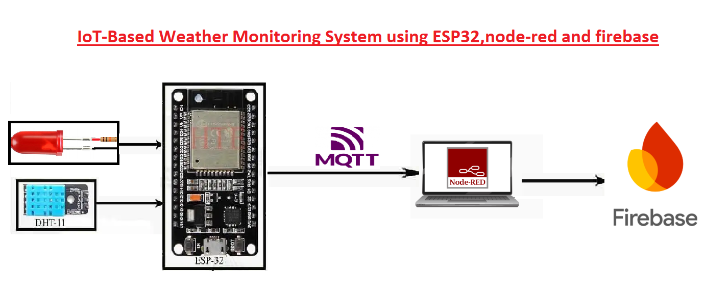
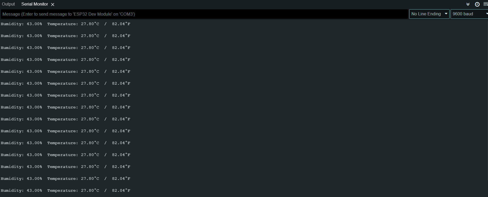

# A-Smart-Weather-Monitoring-System

 IoT-Based Weather Monitoring System using ESP32,node-red and firebase.
 
 Through this system, we can monitor factors such as temperature, humidity,it offers a comprehensive solution for real-time weather data collection, analysis, and remote monitoring.

 

## System Components
1. ESP32: Reads temperature & humidity data from DHT11.
2. DHT11: Collects environmental data.
3. Node-RED: Visualizes the data in real-time dashboards or performs control actions.
4. Firebase: Stores DHT11 sensor data to the cloud.

## Data Flow
1. ESP32 reads temp & humidity from DHT11
2. ESP32 connects to Wi-Fi
3. ESP32 publishes sensor data to an MQTT topics (e.g., weather/Temperature ,weather/Humidity)
4. Node-RED subscribes to these topics
5. Node-RED parses the data and sends it to Firebase via the Firebase node

 
 

  <b>ESP32 - Serial Monitor</b>

                               

 
 

  <b>Node-RED</b>

                                                                
 

<b>Node-RED Dashboard</b>

     

## Demo Video
▶ Watch A-Smart-Weather-Monitoring-System in Action
 https://drive.google.com/file/d/1VUi-l5InGPwrhFvC5PKyC5yBZ7YtkTXn/view?usp=drive_link

